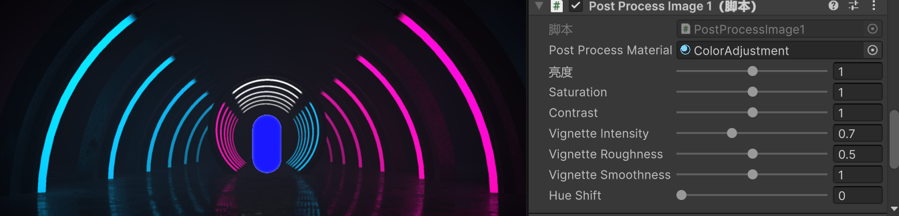
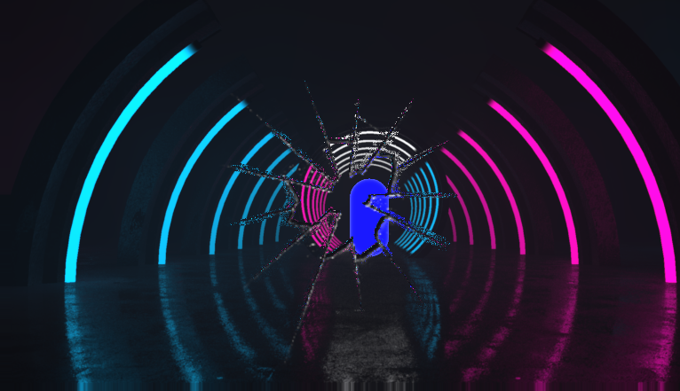
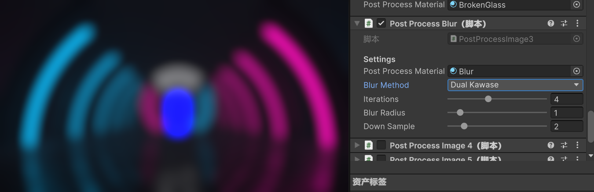
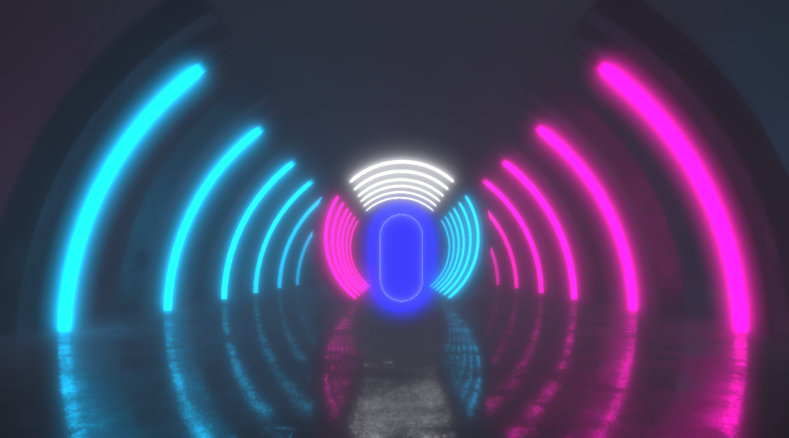
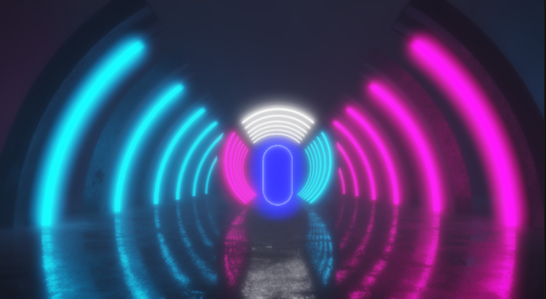

# 🎨 Unity Shader Collection 


> A personal collection of high-quality shaders and post-processing effects for Unity.

> 这是一个用于存放我个人编写的 Shader、后处理特效以及相关脚本的仓库。既是我的学习笔记，也是我的工具库。

## ✨ Shaders

### 光照 (Lighting)

### 后处理 (Post-Processing)

- [P001]**颜色调整 (Color Grading)**: 实现色调映射、饱和度和对比度调整的后处理效果。

- [P002]**屏幕碎裂 (Screen Shatter)**: 模拟屏幕破碎效果的后处理 Shader。

- [P003]**模糊效果 (Blur Effect)**: 实现模糊的后处理效果。
  - 盒状模糊 Box Blur
  - 高斯模糊 Gaussian Blur
  - Kawase模糊 Kawase Blur
  - Dual Kawase模糊 Dual Kawase Blur

  

- [P004]**泛光 (Bloom)**: 实现泛光效果的后处理 Shader。

- [P005]**ACSE-Tonemmap**: ACSE算法的色调映射后处理。

...


## 📂 Directory Structure (目录结构示例)
```text
Assets/
├── Shaders/
│   ├── PostProcess/       # 后处理相关的 Shader 和 C# 脚本
│   ├── VFX/               # 特效 Shader 
│   └── ...
└── Image/ # 存放shader效果截图
```